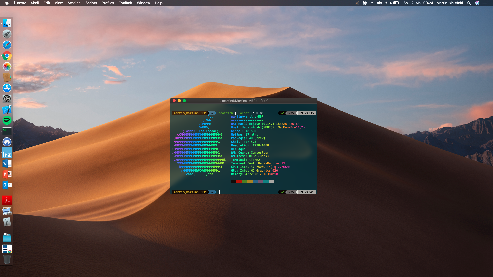

## This is my near perfect Setup for Mojave 10.14.6

Disclaimer:
The system is running very stable and achieves better benchmark scores than Windows 10. This repo isn't meant as a guide by any means. I probably screwed up something in the process of creating this Hackintosh or there are better alternatives to tackle the problems I faced.
Nevertheless I'm proud how this build turned out and if you happen to have the same machine you can certainly use the provided material as a starting point, as it's a full bootable copy of all necessary files from my EFI partition :) To use this simply clone the repo and place EFI folder on your EFI partition. The setup works on 10.14.6 as stated in the title.
# Specs
 -  CPU: i7-7500U
 -  GPU: Intel HD Graphics 620
 -  RAM: 16 GB
 -  Wifi: Intel Dual Band Wireless-AC 8260 (not supported in MacOSX)
 -  2 Thunderbolt 3 ports
 
 # Status
 What is working:
 -  Audio
 -  CPU power management (CPUFriend.kext with help of the freqVectorsEdit script)
 -  GPU accelleration (framebuffer patched accordingly)
 -  Brightness controls
 -  USB ports
 -  HDMI (even though it's a bit unstable and I can't figure out why)
 - Thunderbolt 3 (only after cold boot, no hotplug support)
 
 What doesn't work:
 - Bluetooth (partially working, but only when rebooting from another OS)
 -  card reader
 -  built-in Wifi
 -  fingerprint reader

# Kexts
| Kext | URL |
| ------------- | ------------- |
| ACPIBatteryManager | https://bitbucket.org/RehabMan/os-x-acpi-battery-driver/downloads/  |
| AppleALC | https://github.com/acidanthera/AppleALC |
| CodecCommander | https://bitbucket.org/RehabMan/os-x-eapd-codec-commander/downloads/  |
| CPUFriend| https://github.com/acidanthera/CPUFriend |
| FakePCIID  | https://bitbucket.org/RehabMan/os-x-fake-pci-id/downloads/  |
| FakeSMC  | https://bitbucket.org/RehabMan/os-x-fakesmc-kozlek/downloads/  |
| IntelMausiEthernet  | https://bitbucket.org/RehabMan/os-x-intel-network/downloads/  |
| Lilu  | https://github.com/acidanthera/Lilu/releases  |
| USBInjectAll  | https://bitbucket.org/RehabMan/os-x-usb-inject-all/downloads/  |
| VoodooPS2Controller  | https://bitbucket.org/RehabMan/os-x-voodoo-ps2-controller/downloads/  |
| WhateverGreen  | https://github.com/acidanthera/WhateverGreen/releases  |

# BIOS settings
- Config → Network → Wake On LAN: Disabled
- Security → Memory Protection → Execution prevention: Enabled
- Security → Secure Boot: Disabled
- Security → Device Guard: Disabled
- Startup → UEFI/ Legacy Boot: UEFI only
- Startup → CSM support: Yes

# Usefull tools
- Kext updater: https://www.hackintosh-forum.de/forum/thread/32621-kext-updater/
- Hackintool: https://www.tonymacx86.com/threads/release-hackintool-v2-0-4.254559/
- freqVectorsEdit (helpful for CPUFriend): https://github.com/Piker-Alpha/freqVectorsEdit.sh
- Wallpaper: https://www.reddit.com/r/thinkpad/comments/6uyaj2/x1_carbon_5th_gen_exploded_wallpapers_in_4k_inc/

# Disclaimer for Wifi
Getting built-in Wifi working is possible by replacing the card with a BCM94352z. While this is working and I tried myself I face the problem that even though it's working in MacOS, Windows is unable to find Wifi networks. I mainly use Windows 10 as my main OS for university, so for the rare occasions I want/ need to run OSX a TP-Link Wifi dongle does the trick.
